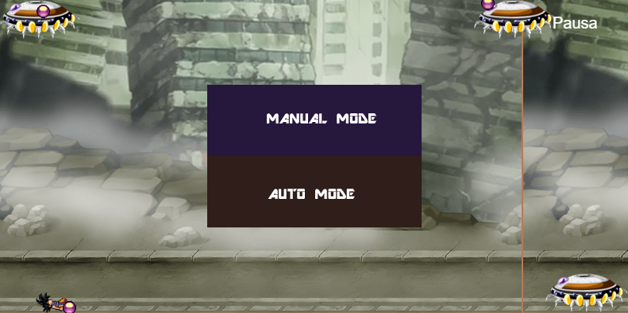

# Proyectos finales 

### Proyectos realizados para la materia de inteligencia artificial. Enero - Junio 2024.

### Jonathan Giovani Ceja Contreras
### No. control: 20120091
---
# 1. Convolutional Neural Network (CNN) 
El proyecto consiste en usar redes neuronales convolucionales como modelos de clasificación de imágenes. La implementación clasificara imágenes con las siguientes 5 clases o etiquetas:
  
* Asaltos
* Inundación
* Incendios
* Robos a casa habitación
* Tornados

A continuación, se explicara a detalle el código requerido para la implementación.

### 1.1 Librerías o dependencias requeridas
Python 3.9

Las siguientes librerías de Python:
* **cv2**: pip install opencv-contrib-python
* **numpy 1.26.4**: pip install numpy
* **matplotlib 3.9.0**: pip install matplotlib
* **scikit-learn 1.5.0**: pip install scikit-learn
* **keras 3.3.3**: pip install keras
* **tensorflow 2.16.1**: pip install tensorflow

### 1.2 Función para capturar frames de videos
Para el proceso de la recolección del dataset de las imágenes para alimentar al modelo con las categorías para clasificar, se utiliza el siguiente código:

Primero se importa la librería **cv2** y **os** 

``` python

import cv2 as cv
import os
```
Después, se define en una constante el nombre del **directorio** en donde se deberá guardar los frames capturados, el video **cap** del que se tomaran los frames, luego se define una variable **i** como contador y un segundo **contador** que toma el total de archivos en el directorio de destino, esto para no sobreescribir las imágenes existentes. 

``` python
directorio = "robocasa"
cap = cv.VideoCapture("../assets/videos/robo casa/robocasa f.mp4")
i=0
contador=len(os.listdir(directorio))
```
Luego se define una ultima constante, para controlar el intervalo de frames que deben pasar para guardar el frame del video. Debido a que, si no se controla el intervalo de frames, se generará un dataset con demasiadas imágenes "repetidas", ya que no habría diferencia significativa entre cada imagen al ser capturada frame a frame.

```python
frame_interval = 10  # Capturar una imagen cada n frames
```

En seguida, se entra en un ciclo infinito que va leyendo del video hasta que finalice la duración del video o se presione la tecla ESC (27), en el cuerpo de la función se valida si el contador es múltiplo del intervalo de frames definidos, entonces muestra el frame en una ventana con resize, para finalmente guardar el frame en el directorio destino.
``` python
while True:
    ret, frame = cap.read()
    if not ret:
        break    
    if i % frame_interval == 0:
        resized_frame = cv.resize(frame, (28, 21))
        cv.imshow('img', resized_frame)
        cv.imwrite(f'{directorio}/data{contador}.jpg', resized_frame)
        contador+=1
        
    i=i+1    
    k = cv.waitKey(1)
    if k == 27:
        break
cap.release()
cv.destroyAllWindows()

```

### 1.3 Función para eliminar archivos de un directorio
Otra función que fue requerida en el proceso de generar el dataset de imágenes, es la de eliminar todos archivos de un directorio especifico para descartar rápidamente las imágenes incorrectas y volver a repetir el proceso de captura.
```python
directorio = "robocasa"
eliminar_archivos_directorio(directorio)
```
El cuerpo de la función se muestra a continuación.
```python
import os
def eliminar_archivos_directorio(directorio):
    # Verifica si el directorio existe
    if not os.path.exists(directorio):
        print(f"El directorio {directorio} no existe.")
        return

    # Recorre todos los archivos en el directorio
    for archivo in os.listdir(directorio):
        ruta_archivo = os.path.join(directorio, archivo)
        
        # Verifica si es un archivo antes de eliminar
        if os.path.isfile(ruta_archivo):
            os.remove(ruta_archivo)
            print(f"Archivo eliminado: {ruta_archivo}")

```

### 1.4 Importación de librerías
Para la ejecución de los siguientes bloques de código, se requieren de las siguientes importaciones
```python
import numpy as np
import os
import re
import matplotlib.pyplot as plt
%matplotlib inline
from sklearn.model_selection import train_test_split
from sklearn.metrics import classification_report
import keras
import tensorflow as tf
from tensorflow.keras.utils import to_categorical
from keras.models import Sequential,Model, load_model
from tensorflow.keras.layers import Input
from keras.layers import Dense, Dropout, Flatten
from tensorflow.keras.layers import (
    BatchNormalization, SeparableConv2D, MaxPooling2D, Activation, Flatten, Dropout, Dense, Conv2D
)
from keras.layers import LeakyReLU
from tensorflow.keras.optimizers import SGD
```

### 1.5 Carga del dataset de imágenes

Definición de variables. dirname guarda la ruta completa de donde se encuentra el directorio del dataset de imágenes. 
* **os.getcwd()** obtiene el directorio de trabajo actual.
* **os.path.join(os.getcwd(), 'dataset/')** combina el directorio de trabajo actual con 'dataset2/' para formar la ruta completa al directorio dataset2.
* **os.sep** es el separador de directorios específico del sistema operativo (por ejemplo, '/' en Unix o '' en Windows). Al final se guarda la ruta completa en **imgpath**
  
```python
dirname = os.path.join(os.getcwd(),'dataset/')
imgpath = dirname + os.sep 

images = []
directories = []
dircount = []
prevRoot=''
cant=0
```

Después, en el cuerpo de la función se hace un doble ciclo, en el primero se itera por cada directorio encontrado el la ruta especificada, y el segundo itera por cada imagen dentro del directorio.

Dentro del segundo ciclo, se hace una validación de tipo de archivo, para aceptar solo **jpg|jpeg|png|bmp|tiff** como formato de imagen valida. Por cada iteración, se guarda las imágenes leídas en el directorio, los directorios recorridos y la suma total de las imágenes en cada subdirectorio.

```python
for root, dirnames, filenames in os.walk(imgpath):
    for filename in filenames:
        if re.search("\.(jpg|jpeg|png|bmp|tiff)$", filename):
            cant=cant+1
            filepath = os.path.join(root, filename)
            image = plt.imread(filepath)
            if(len(image.shape)==3):
                
                images.append(image)
            b = "Leyendo..." + str(cant)
            print (b, end="\r")
            if prevRoot !=root:
                print(root, cant)
                prevRoot=root
                directories.append(root)
                dircount.append(cant)   
                cant=0

dircount.append(cant)
dircount = dircount[1:]
dircount[0]=dircount[0]+1
print('Directorios leidos:',len(directories))
print("Imagenes en cada directorio", dircount)
print('suma Total de imagenes en subdirs:',sum(dircount))

```
### 1.6 Creación de etiquetas y categorías
Se definen el total de etiquetas en una variable llamada **labels**
```python
labels=[]
indice=0
for cantidad in dircount:
    for i in range(cantidad):
        labels.append(indice)
    indice=indice+1
print("Cantidad etiquetas creadas: ",len(labels))
```
Después, se guarda en una lista, el nombre de los subdirectorios que representaran a las **categorías para clasificar**
```python
deportes=[]
indice=0
for directorio in directories:
    name = directorio.split(os.sep)
    print(indice , name[len(name)-1])
    deportes.append(name[len(name)-1])
    indice=indice+1
```
### 1.7 Creación de set de Entrenamientos y Test

Primero se convierten la lista de etiquetas a un numpy y la lista de imágenes

```python
y = np.array(labels)
X = np.array(images, dtype=np.uint8) #convierto de lista a numpy

# Find the unique numbers from the train labels
classes = np.unique(y)
nClasses = len(classes)
print('Total number of outputs : ', nClasses)
print('Output classes : ', classes)

```
Despues de utiliza la función de **train_test_split** de scikit-learn
* **X**: Las características del conjunto de datos, que serian las categorías o etiquetas.
* **y**: Los valores objetivo correspondientes a X, las cuales serian las imágenes.
* **test_size=0.2**: Especifica que el **20%** del conjunto de datos debe ser asignado al conjunto de prueba, mientras que el **80%** restante se asigna al conjunto de entrenamiento.

Como salidas obtenemos las siguientes:
* **train_X**: Las características del conjunto de entrenamiento.
* **test_X**: Las características del conjunto de prueba.
* **train_Y**: Las etiquetas del conjunto de entrenamiento.
* **test_Y**: Las etiquetas del conjunto de prueba.

```python
train_X,test_X,train_Y,test_Y = train_test_split(X,y,test_size=0.2)
```
Finalmente, se muestra la primer y segunda imagen del conjunto de entrenamiento, con el siguiente código:

```python
plt.figure(figsize=[5,5])

# Display the first image in training data
plt.subplot(121)
plt.imshow(train_X[0,:,:], cmap='gray')
plt.title("Ground Truth : {}".format(train_Y[0]))

# Display the first image in testing data
plt.subplot(122)
plt.imshow(test_X[0,:,:], cmap='gray')
plt.title("Ground Truth : {}".format(test_Y[0]))
```


### 1.8 Creación el One-hot Encoding para la red
Esta estrategia consiste en crear una columna binaria (que solo puede contener los valores 0 o 1) para cada valor único que exista en la variable categórica que estamos codificando, y marcar con un 1 la columna correspondiente al valor presente en cada registro, dejando las demás columnas con un valor de 0. 

```python
# Change the labels from categorical to one-hot encoding
train_Y_one_hot = to_categorical(train_Y)
test_Y_one_hot = to_categorical(test_Y)
```
Utilizamos la función de **to_categoria** de keras.utils que convierte etiquetas categóricas a una matriz de codificación one-hot
Teniendo una salida como se muestra a continuación:
```python
# Display the change for category label using one-hot encoding
print('Original label:', train_Y[0])
print('After conversion to one-hot:', train_Y_one_hot[0])

Original label: 1
After conversion to one-hot: [0. 1. 0. 0. 0.]
```

### 1.9 Creación del modelo CNN
A continuación, se definen algunas constantes necesarias que representan los parámetros para crear el modelo CNN.

```python
#declaramos variables con los parámetros de configuración de la red
INIT_LR = 1e-3 # Valor inicial de learning rate. El valor 1e-3 corresponde con 0.001
epochs = 20 # Cantidad de iteraciones completas al conjunto de imagenes de entrenamiento
batch_size = 64 # cantidad de imágenes que se toman a la vez en memoria
```

Después, se guarda en la variable sport_model la instancia **Sequencial**. La clase Sequential permite construir modelos de manera lineal, donde las capas se apilan una tras otra.

```python
sport_model = Sequential()
sport_model.add(Conv2D(32, kernel_size=(3, 3),activation='linear',padding='same',input_shape=(21,28,3)))
sport_model.add(LeakyReLU(alpha=0.1))
sport_model.add(MaxPooling2D((2, 2),padding='same'))
sport_model.add(Dropout(0.5))


sport_model.add(Flatten())
sport_model.add(Dense(32, activation='linear'))
sport_model.add(LeakyReLU(alpha=0.1))
sport_model.add(Dropout(0.5))
sport_model.add(Dense(nClasses, activation='softmax'))
```
En el proceso de creación del modelo, se agregan capas como:
* **Conv2D**: Agrega una capa convolucional con 32 filtros y un tamaño de kernel de (3, 3), tambien se especifica el tamaño de las imágenes del conjunto, el cual fue de 21x28 para cada imagen.
* **LeakyReLU**: Agrega una capa LeakyReLU con un coeficiente alpha de 0.1 para evitar el problema de unidades muertas
* **MaxPooling2D**: Reduce las dimensiones espaciales de la salida mediante una ventana de 2x2. Con el padding='same': Mantiene las dimensiones de salida iguales a las de entrada.
* **Dropout(0.5)**: Apaga aleatoriamente el 50% de las neuronas durante el entrenamiento para prevenir el sobreajuste.
* **Flatten()**: Convierte la salida 2D en una única dimensión (vector) para la entrada en la capa densa.
* **Dense(32, activation='linear')**: Agrega una capa densa con 32 neuronas y activación lineal.

Se agrega la ultima capa de activación:
* **Dense(nClasses, activation='softmax')**: Agrega una capa densa con un número de neuronas igual al número de clases (nClasses). Con activation='softmax', utiliza la activación softmax para obtener probabilidades para cada clase.

Al ejecutar la función **summary()** podemos ver un resumen de las capas del modelo creado


Por ultimo, compilamos el modelo, usando la siguiente instrucción.

```python
sport_model.compile(
    loss='categorical_crossentropy',
    optimizer=SGD(learning_rate=INIT_LR, decay=INIT_LR / 100),
    metrics=['accuracy']
)
```

### 1.10 Entrenamiento del modelo

Para entrenar el modelo, usamos la función **fit**, mandando los parámetros requeridos. Entre ellos, datos obtenidos en el entrenamiento y test realizado anteriormente, etiquetas y los datos de validación.

```python
sport_train = sport_model.fit(
    train_X, train_label,
    batch_size=batch_size,
    epochs=epochs,
    verbose=1,
    validation_data=(valid_X, valid_label)
)
```

Finalmente, se guarda el modelo entrenado para no volver a repetir el proceso cuando se quiera volver a usar.

```python 
sport_model.save("cnn.h5")
```

### 1.11 Cargar un modelo entrenado
Si se requiere cargar un modelo que ya este entrenado, se realizan las siguientes instrucciones:

```python
# Ruta del archivo .h5
model_path = 'cnn_temp.h5'

# Cargar el modelo
sport_model = load_model(model_path)

# Verifica la estructura del modelo
sport_model.summary()
```

### 1.12 Evaluar la red
Utilizando la función **evaluate()** podemos evaluar la red entrenada, se le manda los siguientes datos:

* **test_X**: Representa a los datos de entrada de prueba
* **test_Y_one_hot**: Las etiquetas de prueba correspondientes
* **verbose**: Un entero que controla la verbosidad del proceso. 0 significa silencio, 1 significa barra de progreso.

```python
test_eval = sport_model.evaluate(test_X, test_Y_one_hot, verbose=1)
```
Teniendo como resultado:
* Test loss: 0.20288848876953125
* Test accuracy: 0.9549939036369324

Además, es posible graficar la exactitud y de imprecisión, usando la librería matplotlib con el siguiente código:

```python
accuracy = sport_train.history['accuracy']
val_accuracy = sport_train.history['val_accuracy']
loss = sport_train.history['loss']
val_loss = sport_train.history['val_loss']
epochs = range(len(accuracy))
plt.plot(epochs, accuracy, 'bo', label='Training accuracy')
plt.plot(epochs, val_accuracy, 'b', label='Validation accuracy')
plt.title('Training and validation accuracy')
plt.legend()
plt.figure()
plt.plot(epochs, loss, 'bo', label='Training loss')
plt.plot(epochs, val_loss, 'b', label='Validation loss')
plt.title('Training and validation loss')
plt.legend()
plt.show()
``` 

Teniendo un resultado como se muestra en las siguientes imágenes, para exactitud e imprecisión, respectivamente.


Después, podemos evaluar la cantidad de etiquetas correctas e incorrectas, con el siguiente código:

```python
predicted_classes2 = sport_model.predict(test_X)
predicted_classes=[]
for predicted_sport in predicted_classes2:
    predicted_classes.append(predicted_sport.tolist().index(max(predicted_sport)))
predicted_classes=np.array(predicted_classes)
```
Primero se obtiene los valores de predicción con la función **predict**, mandando el conjunto de datos de entrenamiento **test_X**

Después, se muestra la cantidad de **etiquetas correctas** y una muestra de 9 imágenes del conjunto de **entrenamiento**

Found 7066 correct labels


Por otro lado, se muestra la cantidad de **etiquetas incorrectas** y otra muestra de 9 imágenes que muestran la imprecisión del modelo al confundir clases.

```python
incorrect = np.where(predicted_classes!=test_Y)[0]
print("Found %d incorrect labels" % len(incorrect))
for i, incorrect in enumerate(incorrect[0:9]):
    plt.subplot(3,3,i+1)
    plt.imshow(test_X[incorrect].reshape(21,28,3), cmap='gray', interpolation='none')
    plt.title("{}, {}".format(deportes[predicted_classes[incorrect]],
                                                    deportes[test_Y[incorrect]]))
    plt.tight_layout()
```

Found 333 incorrect labels


Finalmente, podemos obtener una tabla en donde se muestra la precisión de cada clase, asi como otros parametros.

```python
target_names = ["Class {}".format(i) for i in range(nClasses)]
```
0 asalto
1 incendios
2 inundacion
3 robocasa
4 tornados

              precision    recall  f1-score   support

     Class 0       0.95      0.96      0.95      1960
     Class 1       0.99      1.00      1.00      1298
     Class 2       0.90      0.90      0.90      1367
     Class 3       0.97      0.96      0.97      1549
     Class 4       0.96      0.96      0.96      1225

    accuracy                           0.95      7399
   macro avg       0.96      0.96      0.96      7399
weighted avg       0.96      0.95      0.95      7399

### 1.13 Función para probar el modelo

El siguiente código sirve para mostrar el resultado que devuelve el modelo con imágenes de entrada. En la lista **filenames** se escribe la ruta de la o las imágenes de entrada a clasificar, después, cada imagen de entrada se muestra en un frame con un texto que indica a la clase que pertenece usando la función **predict**.

```python
from skimage.transform import resize
import cv2 as cv

images=[]

#incendios
filenames = ['incendio.jpg','incendio.jpeg','incendio3.jpeg']
```

Se itera por cada imagen en la lista de imágenes, guardando la imagen redimensionada a 21x28 y la lista resultante se convierte a numpy en una variable llamada **test_X**

```python
for filepath in filenames:
    image = plt.imread(f'test/{filepath}',0)
    image_resized = resize(image, (21, 28),anti_aliasing=True,clip=False,preserve_range=True)
    images.append(image_resized)

X = np.array(images, dtype=np.uint8) #convierto de lista a numpy
test_X = X.astype('float32')
test_X = test_X / 255.

```

Luego se definen algunas constantes para la configuración del frame con la imagen de entrada y resultado

```python
# Especificar las nuevas dimensiones (ancho, alto)
nuevo_ancho = 600
nuevo_alto = 400
dimensiones = (nuevo_ancho, nuevo_alto)

posicion = (0, nuevo_alto)  # (x, y)

# Tamaño de la fuente
escala_fuente = 1

# Colores
color_texto = (255, 255, 255)  # Blanco
color_fondo = (0, 0, 0)        # Negro

# Grosor del texto
grosor_texto = 2

# Fuente del texto
fuente = cv.FONT_HERSHEY_DUPLEX

```

Finalmente, se usa la función **predict**. predicted_classes contiene las predicciones, donde cada predicción es un vector de probabilidades para cada clase. Convierte **img_tagged** a una lista (img_tagged.tolist()), encuentra el índice de la probabilidad máxima (img_tagged.tolist().index(max(img_tagged))) y utiliza este índice para encontrar la etiqueta correspondiente en la lista de clases.

```python
#Predecir clases
predicted_classes = sport_model.predict(test_X)

for i, img_tagged in enumerate(predicted_classes):
    print(filenames[i], deportes[img_tagged.tolist().index(max(img_tagged))])

    # # Leer la imagen
    imagen = cv.imread(f'test/{filenames[i]}')
    # Redimensionar la imagen
    imagen_redimensionada = cv.resize(imagen, dimensiones)

    # Especificar el texto y su posición
    texto = deportes[img_tagged.tolist().index(max(img_tagged))]

    # Obtener el tamaño del texto
    (tamaño_texto, _) = cv.getTextSize(texto, fuente, escala_fuente, grosor_texto)

    # Calcular las coordenadas del rectángulo de fondo
    posicion_inferior_izquierda = posicion
    posicion_superior_derecha = (posicion[0] + tamaño_texto[0], posicion[1] - tamaño_texto[1] - 10)


    # Dibujar el rectángulo de fondo
    cv.rectangle(imagen_redimensionada, posicion_inferior_izquierda, posicion_superior_derecha, color_fondo, cv.FILLED)

    # Dibujar el texto sobre el rectángulo
    cv.putText(imagen_redimensionada, texto, posicion, fuente, escala_fuente, color_texto, grosor_texto)

    # Mostrar la imagen con el texto
    cv.imshow('Imagen', imagen_redimensionada)

    # Esperar a que se presione una tecla para cerrar la ventana
    cv.waitKey(0)
    cv.destroyAllWindows()

```
A continuación, se muestran capturas de los resultados obtenidos.

Incendios


Inundación


Tornados


Robo casa


Asalto


# 2. ¿Donde está Wally?
Este proyecto consiste en generar un modelo que permita reconocer al personaje de Wally en una imagen.

### 2.1 Librerías o dependencias requeridas
Python 3.9

Las siguientes librerías de Python:
* **cv2**: pip install opencv-contrib-python
* **numpy 1.26.4**: pip install numpy
* Para generar el **xml clasificador**, necesitaremos el programa de Cascade Trainer GUI. Link del sitio oficial: https://amin-ahmadi.com/cascade-trainer-gui/

### 2.2 Función de rotación de imágenes
Para generar el dataset de imágenes de Wally, se utilizaron algunas funciones de transformación de imágenes, una de ellas, es para rotar una imagen. A continuación, se muestra el código.

En las primeras líneas del cuerpo de la función, se definen las dimensiones de salida que debera de tener la imagen transformada, que son de 50x50. 

``` python
import datetime
def rotar(img, i):
    # Dimensiones deseadas de salida
    salida_ancho = 50
    salida_alto = 50

```
Para evitar que al rotar la imagen, se generen **partes de la imagen de color negro**, antes de la rotación, se genera una imagen de fondo blanco de 50x50 pixeles, luego se redimensiona la imagen original para que las proporciones esten dentro del área de rotación. Despues se calcula el centro de la imagen redimensionada y la del fondo blanco.

```python    
    # Crear una imagen de fondo blanco de 50x50 píxeles
    fondo_blanco = np.ones((salida_alto, salida_ancho, 3), dtype=np.uint8) * 255
    
    # Redimensionar la imagen original para que quepa en el área de rotación
    h, w = img.shape[:2]
    escala = min(salida_ancho/w, salida_alto/h)
    nueva_ancho = int(w * escala)
    nueva_alto = int(h * escala)
    img_redimensionada = cv.resize(img, (nueva_ancho, nueva_alto))
    
    # Calcular el centro de la imagen redimensionada y del fondo blanco
    centro_imagen = (nueva_ancho // 2, nueva_alto // 2)
    centro_fondo = (salida_ancho // 2, salida_alto // 2)

```

Despues, se procede con la rotación, haciendo uso de la función **getRotationMatrix2D**() de opencv. Se le mandan los siguientes parametros:
* **center**: Una tupla (x, y) que representa el punto alrededor del cual se rota la imagen
* **angle**: El ángulo de rotación en grados. Los valores positivos rotan la imagen en sentido antihorario, y los valores negativos en sentido horario.
* **scale**: Un factor de escala. Un valor de 1 significa que la imagen mantiene su tamaño original, valores mayores la amplían y valores menores la reducen.

Una vez creada la matriz de rotación, se le aplica a la imagen redimensionada, haciendo uso de **warpAffine()**. Los parametros representan lo siguiente:

* **src**: La imagen de entrada.
* **M**: La matriz de transformación afín 2x3.
* **dsize**: El tamaño de la imagen de salida en forma de tupla (ancho, alto).
* **borderValue**: El borde que representa el color blanco (255,255,255)

Finalmente, se obtiene un **timestamp** para no sobreescribir las imágenes transformadas.

```python
    # Crear la matriz de rotación
    mw = cv.getRotationMatrix2D(centro_fondo, grados, 1)
    
    # Aplicar la rotación a la imagen redimensionada
    img_rotada = cv.warpAffine(img_redimensionada, mw, (salida_ancho, salida_alto), borderValue=(255, 255, 255))

    # Obtener el timestamp actual
    timestamp = datetime.datetime.now().strftime("%Y%m%d_%H%M%S")

    # Guardar la imagen resultante
    cv.imwrite(f'result/img_{i}_{timestamp}.png', img_rotada)
```

### 2.3 Función de modo espejo de imágenes
Con el fin de obtener más imagenes a partir de una misma imagen base, se utiliza una función para aplicar el modo espejo a una imagen. El código se muestra a continuación.

```python
import datetime
def espejo(img, i):
    # Crea una imagen espejo usando flip
    img_espejo = cv.flip(img, 1)

    # Obtener el timestamp actual
    timestamp = datetime.datetime.now().strftime("%Y%m%d_%H%M%S")
    cv.imwrite(f'result/img_{i}_{timestamp}.png', img_espejo)
```

Se hace uso de la función **flip()** de opencv, los parametros representan lo siguiente:
* **src**: La imagen de entrada que se desea voltear.
* **flipCode**: Un código que especifica cómo voltear la imagen. 
  * 0: Voltea la imagen verticalmente (alrededor del eje x).
  * 1: Voltea la imagen horizontalmente (alrededor del eje y).
  * -1: Voltea la imagen tanto vertical como horizontalmente.

Finalmente, se guarda la imagen transformada en un directorio destino, usando un timestamp para no sobreescribir imágenes previamente transformadas en el directorio.

### 2.4 Función para generar subimagenes a partir de una imagen
Esta función tiene como proposito el generar subimagenes a partir de una imagen, para obtener una colección de imagenes que serviran para la etiqueta de "Negativas" (n), es decir, las imágenes en donde **no esta** Wally.

```python
# Abre la imagen base
img = cv2.imread('generador/base negativo/base8.png')

# Obtiene las dimensiones de la imagen
height, width = img.shape[:2]

# Define el tamaño de las sub-imágenes
sub_width, sub_height = 50, 50

# Crea el directorio de salida si no existe
output_dir = 'result'
if not os.path.exists(output_dir):
    os.makedirs(output_dir)

# Recorre la imagen creando las sub-imágenes
i = 0
for y in range(height-sub_height, -1, -sub_height):
    for x in range(width-sub_width, -1, -sub_width):
        # Crea la sub-imagen
        sub_img = img[y:y+sub_height, x:x+sub_width]
        # Obtener el timestamp actual
        timestamp = datetime.datetime.now().strftime("%Y%m%d_%H%M%S")
        # Guarda la sub-imagen
        cv2.imwrite(os.path.join(output_dir, f'n{i}_{timestamp}.png'), sub_img)
        i += 1                
```

### 2.5 Función para convertir a escala de grises una imagen
La siguiente función convierte una imagen a escala de grises, utilizando la función de **cvtColor** 
* **src**: La imagen de entrada.
* **code**: El código que especifica el tipo de conversión de color. Para este se utiliza la constante **cv.COLOR_BGR2GRAY**

```python
def convertir_gris(img, i):
    frame = cv.cvtColor(img, cv.COLOR_BGR2GRAY)    
    cv.imwrite(f'dataset/n/wally{i}.png', frame)
```

### 2.6 Código para probar el modelo
Una vez generado el XML clasificador a traves del software Cascade Trainer GUI, lo ponemos a prueba para encontrar a Wally, con el siguiente código.

Primero, mediante la función de opencv **CascadeClassifier('cascade_v1.xml')** se manda como parametro la ruta del XML. Luego, en un frame leemos la imagen de test con **imread()**. Despues, el frame se transforma a escala de grises con la función de cv.**cvtColor()**.

Posteriormente, se usa la función de **detectMultiScale**, la recibe los siguientes parametros:

* **image**: La imagen en la que se detectan los objetos. Generalmente, esta imagen debe estar en escala de grises.
* **scaleFactor**: Especifica cuánto reduce el tamaño de la imagen en cada escala de imagen. Por ejemplo, scaleFactor=1.1 significa que la imagen se reduce en un 10% en cada escala. Cuando tiende a ser menor que 1, el procesamiento es menos rapido y por lo tanto, se tendran menos falsos resultados, caso contrario, si es mayor a 1, el procesamiento es más rapido y por lo tanto, se tendran más falsos resultados. 
* **minNeighbors**: Especifica cuántos vecinos deben tener cada rectángulo candidato para retenerlo. Un valor más alto da menos detecciones pero de mayor calidad.
* **minSize**: Tupla que define el tamaño mínimo de los objetos a detectar. Por defecto es (30, 30).

```python
import cv2 as cv    

wally = cv.CascadeClassifier('cascade_v1.xml')

frame = cv.imread('assets/escenarios/escenario1b.png')

gray = cv.cvtColor(frame, cv.COLOR_BGR2GRAY)

wallys = wally.detectMultiScale(gray, 1.4, 52)

for (x, y, w, h) in wallys:
    frame = cv.rectangle(frame, (x,y), (x+w, y+h), (0, 255, 0), 2)

cv.imshow('Wally', frame)

cv.waitKey(0)
cv.destroyAllWindows()
```

Al final, se grafican rectangulos para cada resultado obtenido. A continuación, se muestran algunos ejemplos de los resultados.


# 3. Reconocedor de emociones
El proyecto conciste en generar un modelo clasificador que sea capaz de reconocer las siguientes emociones en las personas:

* Felicidad
* Enojo
* Sorprendido

### 3.1 Librerías o dependencias requeridas
Python 3.9

Las siguientes librerías de Python:
* **cv2**: pip install opencv-contrib-python
* **numpy 1.26.4**: pip install numpy

### 3.2 Función para genera el XML clasificador
Para generar el XML se utiliza el metodo Local Binary Patterns Histograms **(LBPH)**. El método LBPH es una técnica de reconocimiento facial en OpenCV que utiliza características locales de la imagen para identificar caras. Este método es eficaz y relativamente simple, basado en la textura de la imagen para realizar el reconocimiento.

A continuación, se muestra el código para generar el XML.

```python
import cv2 as cv 
import numpy as np 
import os

dataSet = "emociones"
faces  = os.listdir(dataSet)

labels = []
facesData = []
label = 0 
for face in faces:
    facePath = dataSet+'\\'+face
    for faceName in os.listdir(facePath):
        labels.append(label)
        facesData.append(cv.imread(facePath+'\\'+faceName,0))
    label = label + 1
faceRecognizer = cv.face.LBPHFaceRecognizer_create()
faceRecognizer.train(facesData, np.array(labels))
faceRecognizer.write('emociones.xml')
```
Como se observa, se establece una ruta en donde se encuentra el dataset con las etiquetas para cada emoción, es decir, un subdirectorio por cada emoción para poder clasificarlas.

Despues, se itera por cada subdirectorio y cada imagen contenida en el mismo. Hasta finalmente utilizar el metodo **train**, que recibe como parametro los frames de cada imagen leida, además de las etiquetas en formato de numpy.

Finalmente, una vez entrenado, se guarda el xml con el metodo **write**, para que cuando necesitemos volver a utilizar el clasificador, no se tenga que volver a entrenar con el dataset.

### 3.3 Función para probar el clasificador
Para poner a prueba el modelo, se muestra el siguiente codigo:

Primero, se crea una instancia de FaceRecognizer con el metodo **LBPHFaceRecognizer_create()** y se carga el xml previamente generado.

```python
import cv2 as cv

faceRecognizer = cv.face.LBPHFaceRecognizer_create()
faceRecognizer.read("emociones.xml")
```

Segundo, se define cual es la lista de etiquetas disponibles para clasificar. Se carga, además, el **"haarcascade_frontalface_alt"**, clasificador en cascada para la detección de rostros.

```python
faces = ["enojo","feliz","sorpresa"]
rostro = cv.CascadeClassifier('haarcascade_frontalface_alt.xml')
```

Despues, se entra al ciclo infinito para reconocer rostros, hasta que se presione la tecla **ESC** del teclado.

Se lee el frame capturado por la camara de video, luego se convierte a escala de grises con la función de **cvtColor(frame, cv.COLOR_BGR2GRAY)** y se hace uso de la función **detectMultiScale(gray, 1.3, 3)** con una escala de 1.3, y un **minNeighbors** de 3.

```python
cap = cv.VideoCapture(0)
while True:
    ret, frame = cap.read()
    if ret == False: break
    gray = cv.cvtColor(frame, cv.COLOR_BGR2GRAY)
    cpGray = gray.copy()
    rostros = rostro.detectMultiScale(gray, 1.3, 3)
```
Posteriormente, se procesa cada rostro detectado. Tomando un area de interes correspondiente al rostro detectado, luego se redimensiona a 100x100 pixeles. Se predice la emoción usando el modelo LBPH con el metodo **predict**.

Si la confianza de predicción es mayor a 80, se toma como desconocido, de lo contrario, si el nivel es menor a 80, se acepta y se muestra el texto con la emoción detectada como resultado.

```python
    for(x, y, w, h) in rostros:
        frame2 = cpGray[y:y+h, x:x+w]
        frame2 = cv.resize(frame2,  (100,100), interpolation=cv.INTER_CUBIC)
        result = faceRecognizer.predict(frame2)        
        if result[1] < 80:
            cv.putText(frame,'{}'.format(faces[result[0]]),(x,y-25),2,1.1,(0,255,0),1,cv.LINE_AA)
            cv.rectangle(frame, (x,y),(x+w,y+h),(0,255,0),2)
        else:
            cv.putText(frame,'No identificado',(x,y-20),2,0.8,(0,0,255),1,cv.LINE_AA)
            cv.rectangle(frame, (x,y),(x+w,y+h),(0,0,255),2) 
    cv.imshow('frame', frame)
    k = cv.waitKey(1)
    if k == 27:
        break
cap.release()
cv.destroyAllWindows()

```

En el método **LBPH** valores **bajos de confianza** indican **alta similitud** y por lo tanto, alta confianza en la predicción. Valores **altos de confianza** indican **baja similitud** y por lo tanto, baja confianza en la predicción.


# 4. Juego Phaser 3 naves
Este proyecto consiste en implementar una red neuronal que con las entradas y salidas logre hacer el modo automático en el juego. Se trata de 3 naves que disparan balas, una bala cae verticalmente sobre el jugador, otra se desplaza horizontalmente sobre el jugador y la tercera bala va en diagonal. El jugador puede hacer saltos o moverse a la izquierda, si cualquiera de las balas colisiona con la hitbox del jugador, el juego termina.

### 4.1 Librerías o dependencias requeridas
Lenguaje de desarrollo: **Javascript**
* **Phaser**: 2.7.3
* **Synaptic**: 1.0.10

### 4.2 Declaración de variables
Primero se empieza con la declaración de variables y constantes globales. Como el tamaño del frame del juego **w** y **h**, variables para guardar instancias referentes al juego, variables para controlar el estado del jugador, las redes neuronales  y los arreglos para guardar los datos de entrenamiento.

```js
var w = 800;
var h = 400;
var jugador;
var fondo;

var bala, bala2, bala3, balaD = false;
var nave, nave2, nave3;

var salto, derecha, izquierda;
var menu;

var velocidadBala;
var despBala;

var estatusAire;
var estatusIzquierda = 0;

var nnNetwork, nnEntrenamiento, datosEntrenamiento = [];
var nnNetwork2, nnEntrenamiento2, datosEntrenamiento2 = []
var nnNetwork3, nnEntrenamiento3, datosEntrenamiento3 = []

var modoAuto = false, eCompleto = false;
var desplazo = false

const bala3_x = w - 185
const bala3_y = h - 405
const bala2_velocidad = 85

var juego = new Phaser.Game(w, h, Phaser.CANVAS, '', { preload: preload, create: create, update: update, render: render });
```
Al final, se crea una instancia de la clase **Phaser.Game** muy importante para el juego. Cuando se crea la instancia se envían los siguientes parámetros, el **ancho** y **alto** que deberá tener el area del juego, el tipo de renderizado, que en este caso es **CANVAS** y por ultimo, se manda en un objeto funciones tipo **call back**. Las cuales se detallan a continuación:

### 4.3 Función preload
**preload**: esta función se utiliza para cargar todos los recursos (imágenes, videos, audio, sprites, etc.) necesarios antes de que el juego comience. 

Como se muestra en el código, se carga antes de comenzar el juego los archivos media, como sprites e imagenes. Se hace el llamado a la función correspondiente, dependiendo del tipo de recurso a cargar, y después de manda un identificador único y la ruta de acceso, entre otros parámetros de configuración.

```js
function preload() {
    juego.load.image('fondo', 'assets/game/db_escenario2-min.png');
    juego.load.spritesheet('mono', 'assets/sprites/kokun.png', 34, 48);
    juego.load.image('nave', 'assets/game/nave.png');
    juego.load.image('bala', 'assets/sprites/purple_ball.png');
    juego.load.image('menu', 'assets/game/menu.png');
    juego.load.image('goku_tieso', 'assets/game/koku_tieso.png', 38, 50);
}
```
### 4.4 Función create
**create**: Se emplea los recursos cargados en la función *preload* para inicializar objetos y configuración del entorno del juego. Esta función se ejecuta una sola vez, una ves que preload termino de ejecutarse.

A continuación, se explicara el cuerpo de la función.

#### 4.4.1 Configuración de física y fps
Se establece el sistema de física de Arcade de Phaser, la gravedad del eje Y de 800 y la velocidad de fotogramas, de 30 fps.

```js
function preload() {
    juego.physics.startSystem(Phaser.Physics.ARCADE);
    juego.physics.arcade.gravity.y = 800;
    juego.time.desiredFps = 30;
```

#### 4.4.2 Creación de objetos
Se utilizar la instancia creada anteriormente **juego** y con funciones que provee Phaser, se le agregan sprites al mundo. Se definen las coordenadas x, y, y el identificador del recurso.
* fondo
* nave
* nave2
* nave3
* bala
* bala2
* bala3

```js
    fondo = juego.add.tileSprite(0, 0, w, h, 'fondo');
    nave = juego.add.sprite(w - 110, h - 55, 'nave');
    nave2 = juego.add.sprite(w - 800, h - 400, 'nave');
    nave3 = juego.add.sprite(w - 200, h - 400, 'nave');
    bala = juego.add.sprite(w - 100, h, 'bala');
    bala2 = juego.add.sprite(w - 755, h - 405, 'bala');
    bala3 = juego.add.sprite(bala3_x, bala3_y, 'bala');
```

#### 4.4.3 Habilitación de animaciones y limite de colisiones
Se habilitan las físicas para el objeto jugador y bala, y se habilita la detección de colisiones con los limite del mundo. Para que la bala respete los limites del mundo y no se salga más allá de los mismos.

```js
    juego.physics.enable(jugador);
    jugador.body.collideWorldBounds = true;

    juego.physics.enable(bala);
    bala.body.collideWorldBounds = true;

    juego.physics.enable(bala2);
    bala2.body.collideWorldBounds = false;

    juego.physics.enable(bala3);
    bala3.body.collideWorldBounds = false;
```

#### 4.4.4 Creación de red neuronal
Se crean tres redes neuronales.
- **red1**: Controla la bala que va sobre el eje X, la cual tiene 2 para la capa de entrada, 2 capas ocultas con 6 neuronas, y una en la capa de salida.
- **red2**: Controla la bala que va sobre el eje Y, la cual tiene 3 neuronas para la capa de entrada, 2 capas ocultas con 6 neuronas y 1 neurona en la capa de salida.
- **red3**: Controla la interacción del jugador con la bala en diagonal, tiene 2 neuronas en la capa de entrada, 2 capas ocultas con 6 neuronas, y una neurona en la capa de salida.

```js
    nnNetwork = new synaptic.Architect.Perceptron(2, 6, 6, 1);
    nnEntrenamiento = new synaptic.Trainer(nnNetwork);

    nnNetwork2 = new synaptic.Architect.Perceptron(3, 6, 6, 1);
    nnEntrenamiento2 = new synaptic.Trainer(nnNetwork2);

    nnNetwork3 = new synaptic.Architect.Perceptron(2, 6, 6, 1);
    nnEntrenamiento3 = new synaptic.Trainer(nnNetwork3);
```

### 4.5 Función Update
Es la función que se encarga de constantemente actualizar el estado del juego, por ejemplo la actualización de la posición de los sprites, como el siguiente ejemplo:
```js
function update() {
    fondo.tilePosition.x -= 1; 
```
A continuación, se detalla cada componente de la función update.

#### 4.5.1 Detección de colisiones 
En la función de update, encontramos un componente importante del juego, la detección de colisiones. La instancia provee un metodo para la detección de colisiones, como se muestra a continuación:

```js
    juego.physics.arcade.collide(bala, jugador, colisionH, null, this);
    juego.physics.arcade.collide(bala2, jugador, colisionH, null, this);
    juego.physics.arcade.collide(bala3, jugador, colisionH, null, this);
```

Se envian las instancias de **bala** y **jugador** para la detección de colision, si los dos objetos se encuentran en ese estado, entonces se ejecuta la función de **colisionH**.

#### 4.5.2 Controlador de la bala
En la función update, se hacen varios procesos referentes al objeto de bala. 

* **Calculo de distancia**: Usando la función Math, se calcula la diferencia de la distancia en el eje X de la posición del jugador y la bala para guardarse en una variable.

```js
    despBala = Math.floor(jugador.x - bala.x);
    despBala2 = Math.floor(jugador.y - bala2.y);
    despBala3 = Math.floor(jugador.x - bala3.x);
    despBala3b = Math.floor(jugador.y - bala3.y);
```

* **Manejador de disparado de bala**: Para hacer la función del disparo de bala en el eje x, se ejecuta la siguiente rutina

```js
function disparo(){
    const max = modoAuto ? 700 : 500
    velocidadBala = -1 * velocidadRandom(300, max);
    bala.body.velocity.y = 0;
    bala.body.velocity.x = velocidadBala;
    balaD = true;
}
```
Se obtiene una velocidad aleatoria y se le asigna a la propiedad velocity, del body del objeto bala. Al final se activa una bandera, para controlar los disparos de la bala.

Después, en la misma función update, se hace la validación, de que si la posición de la bala ya es menor al eje x del mundo, es decir, si ya no es visible en el mundo, entonces se reinician variables, entre ellas, la variable bandera que se activó cuando se disparó.

```js
    if( bala.position.x <= 0  ){
            resetVariables();
        }
```
Para la bala del eje Y y digonal, se valida la reposición de la bala de la siguiente manera, respectivamente:

```js
    if (bala2.y >= 380) {
            resetBala2()
        }
    if (bala3.position.x <= 0 ) {
            resetPositionBala3()
        }
```

#### 4.5.3 Modo manual
El modo manual es por defecto cuando empieza el juego, dentro de la función update, cuando el modo esta en manual, ocurren una serie de instrucciones, las cuales se muestran a continuación.
```js
    if (modoAuto == false) {
        juegoManual()
    }  
```
Validación dentro de la función de update, que si se cumple, se ejecuta el siguiente código de bloque.

```js
function juegoManual(){
    if (salto.isDown && jugador.body.onFloor()) {
        saltar();
    }

    if (izquierda.isDown) {
        desp_izquierda()
    }
    if (bala.x > 0) {
        datosEntrenamiento.push({
            'input': [despBala, velocidadBala],
            'output': [estatusAire]
        });

    }
    if (bala2.y > 100 && despBala2 > 0) {
        datosEntrenamiento2.push({
            'input': [despBala2, jugador.position.x, bala2.position.x],
            'output': [estatusIzquierda]
        });
    }
    if (bala3.y > 200 && bala3.x > 0) {
        datosEntrenamiento3.push({
            'input': [despBala3, despBala3b],
            'output': [ estatusIzquierda]
        });
    }
}
```

Como se observa, las primeras validaciones controlan la mecánica de movimiento del jugador. La primera condicional, controla la mecánica del salto, si se presiona la tecla de **ESPACIO** y el jugador esta en el suelo, entonces ejecuta la **rutina de salto**. La segunda condicional, controla el desplazamiento a la izquierda del jugador, si se presiona la tecla **A**, entonces ejecuta la función para realizar el desplazamiento.

Asi mismo, lo siguiente es recolectar los datos de entrenamiento y de salida para entrenar a las redes neuronales posteriormente. En cada arreglo se inserta un objeto con las **entradas** (input) y **salidas** (output) en un arreglo. En las entradas se mandan los desplazamientos entra las balas y el jugador, y coordenadas. En las salidas se manda una variable que va de **0 a 1** para indicar si el jugador hizo un determinado movimiento.

#### 4.5.4 Modo automático
Al seleccionar la opción de "Modo automático" en el menu de pausa, se ejecutaran los siguientes bloques de codigo en la función update.

Primero se entrena a la red, como se muestra a continuación
```js
function enRedNeural() {
    nnEntrenamiento.train(datosEntrenamiento, { rate: 0.0003, iterations: 10000, shuffle: true });
    nnEntrenamiento2.train(datosEntrenamiento2, { rate: 0.0003, iterations: 10000, shuffle: true });
    nnEntrenamiento3.train(datosEntrenamiento3, { rate: 0.0003, iterations: 10000, shuffle: true });
}
```
Esta función es sincrona, por lo que, hasta que se termine de entrenar la red, el flujo del programa podra seguir avanzando.

Después, en la función de update se valida si el modo es automático:

```js
    if (modoAuto == true) {
        juegoAutomatico()
    }
```
Entonces, se ejecutan los siguientes bloques de código.
```js
function juegoAutomatico(){
    if (bala2.y > 200) {
        const result = datosDeEntrenamiento2([despBala2, jugador.x, bala2.x])
        if (result) {            
            desp_izquierda()            
        }
    }

    if (bala3.y > 300 && bala3.x > 0) {
        if (datosDeEntrenamiento3([despBala3, despBala3b])) {
            desp_izquierda()            
        }
    }
    if (bala.x > 0 && jugador.body.onFloor()) {
        if (datosDeEntrenamiento([despBala, velocidadBala])) {
            saltar();
        }
    }    
}
```

Como se puede observar, en cada condicional, se hace uso de un método que recibe un arreglo de datos y devuelve una salida, y dependiendo del resultado de la salida, se ejecutaria la acción movimiento del jugador. 

En la primer red que representa a la bala sobre el eje Y, se manda el desplazamiento (diferencia) en el eje Y de la bala con el jugador, y las coordenadas en el eje X del jugador y la bala.

En la segunda red que se asocia a la bala en diagonal, se manda el desplazamiento (diferencia) en el eje X y Y del jugador contra la bala en diagonal.

En la tercer red que representa a la bala sobre el eje X, se manda el desplazamiento (diferencia) en el eje X del jugador y la bala, y la velocidad de la misma, ya que, esta bala a diferencia de las otras, tiene una velocidad variante.

Los metodos se detallan a continuación.

```js
function datosDeEntrenamiento(param_entrada) {
    nnSalida = nnNetwork.activate(param_entrada);
    const result = Math.round(nnSalida[0] * 100);
    return result >= 40;
}

function datosDeEntrenamiento2(param_entrada) {
    nnSalidaMov = nnNetwork2.activate(param_entrada);    
    const result = Math.round(nnSalidaMov[0] * 100);    
    return result > 20        
}

function datosDeEntrenamiento3(param_entrada) {
    nnSalidaMov3 = nnNetwork3.activate(param_entrada);
    const result = Math.round(nnSalidaMov3[0] * 100);    
    return result >= 9
}
```

Como todas la redes neuronales nos ofrecen una salida de una sola neurona, se toma la primer posición del arreglo que resulta de activar la red neuronal con los datos de entrada enviados desde la función de update.

El valor de salida se multiplica por 100 y se **valida que sea mayor al valor minimo esperado para poder realizar el movimiento al jugador**. Si no es el caso, entonces se retorna un **false** y no se ejecuta la función de movimiento.

### 4.6 Implementación
Para el diseño del juego, se ambiento en la animación de Dragon Ball Z, por lo tanto, se utilizan sprites de Goku para el jugador, fondos y naves de la misma.


